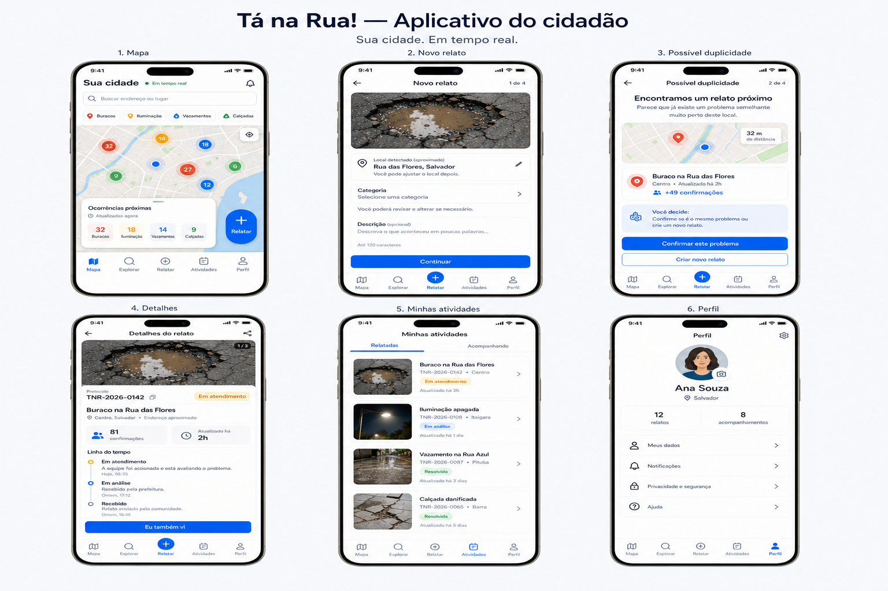

# Direção visual — aplicativo cidadão

Direção aprovada em 20 de julho de 2026 e iniciada na branch `feature/citizen-foundation`.

## Linguagem visual

- azul vivo como cor primária e azul-marinho para títulos;
- muito espaço em branco, bordas discretas e sombras contidas;
- tipografia forte, hierarquia curta e textos em português simples;
- mapas e fotografias como elementos dominantes quando a jornada exigir;
- estados sempre identificados por texto, ícone e cor;
- botões principais largos e alvos de toque confortáveis;
- navegação consistente entre as jornadas cidadãs.

## Jornadas previstas

1. mapa e exploração pública;
2. novo relato guiado;
3. revisão de possível duplicidade;
4. detalhes e linha do tempo;
5. atividades relatadas e acompanhadas;
6. perfil, notificações, privacidade e ajuda.

As jornadas são ativadas somente quando sua fase funcional estiver implementada e validada. A tela inicial atual identifica explicitamente mapa e relatos como uma prévia visual.

## Regras de produto

- a IA pode sugerir classificação, mas a decisão permanece com o cidadão;
- possíveis duplicidades nunca são agrupadas automaticamente;
- endereços públicos devem ser aproximados conforme o contrato da API;
- autoria, coordenadas exatas e informações pessoais não são exibidas publicamente;
- funcionalidades administrativas permanecem separadas do aplicativo cidadão;
- nenhum botão deve sugerir uma ação que ainda não exista no produto.

## Estado da implementação

- tokens de cor, tipografia, raios e sombras adicionados ao design system;
- marca, cabeçalho e rodapé atualizados;
- página inicial modernizada com mapa-conceito acessível e não interativo;
- página de status modernizada sem alterar os contratos `/health` e `/health/database`;
- cadastro e login em composição dividida, com formulário claro e contexto de segurança;
- perfil autenticado em cartões responsivos, com dados permitidos e estado da conta;
- mapa público interativo com filtros compactos, pontos agrupados, lista acessível e detalhes em cartões;
- localização e endereços públicos explicitamente aproximados, com avisos de privacidade próximos ao conteúdo;
- jornadas seguintes ainda não implementadas apresentadas como `Planejado`, sem rotas ou ações falsas.
