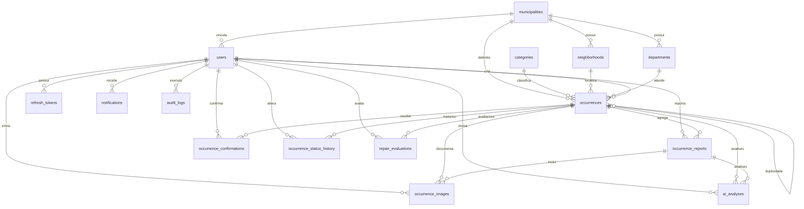

# Diagrama ER - Modelo final do MVP

O diagrama apresenta os relacionamentos fisicos do schema final com 18 tabelas. Colunas de auditoria e integracao com entidades genericas usam `entity_type` e `entity_id` e, por isso, nao possuem chave estrangeira polimorfica.

Tabelas sem relacionamento fisico direto:

- `protocol_counters`: controla a sequencia anual de protocolos;
- `webhook_events`: garante idempotencia de eventos externos;
- `outbox_events`: prepara entrega transacional para n8n e outras integracoes.

Detalhes de enums, constraints e indices ficam nas migrations versionadas e em `src/database/schema`.
